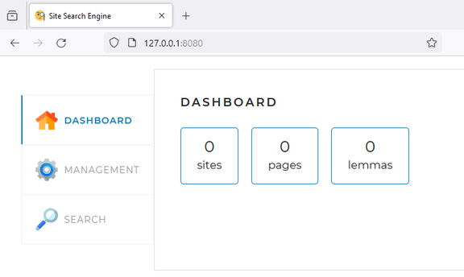
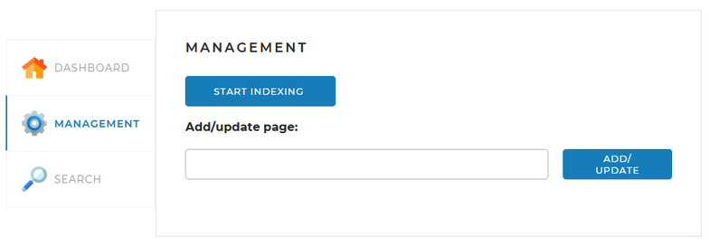
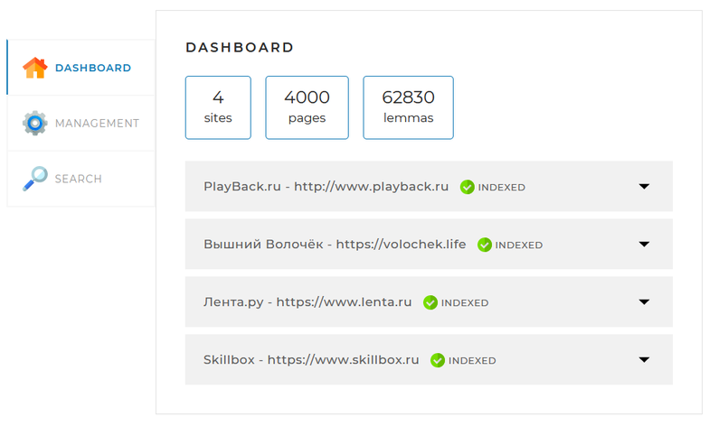
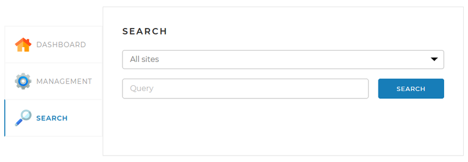

# Поисковый движок SearchEngine 
Поисковый движок SearchEngine — приложение, которое позволяет индексировать страницы сайтов и осуществлять по ним быстрый поиск.

## Стек используемых технологий
Данное приложение написано на языке Java (JDK 17) с использованием фреймворка Spring и системы управления базами данных MySQL.

Для лемматизации и морфологического анализа текста используется библиотека org.apache.lucene.morphology из
репозитория Skillbox https://gitlab.skillbox.ru/api/v4/projects/263574/packages/maven

## Установка приложения для локального запуска
### 1. Установка приложения
Для загрузки скомпилированного приложения и исходного кода необходимо воспользоваться следующей командой:
```
git clone https://github.com/IgorStepanenkov/SearchEngine.git
```
В результате выполнения данной команды в текущей директории будет создан подкаталог `SearchEngine` со всеми файлами приложения.

### 2. Установка СУБД MySQL и создание базы данных
Для работы приложения необходимо установить локальный сервер СУБД MySQL.
Примеры инструкций можно найти на следующих ресурсах обучающей платформы [Skillbox](https://skillbox.ru):
- [Установка MySQL 8.0 + Worbench на Windows 7/8/10+](https://skillbox-manuals.github.io/manuals/docs/mysql-workbench-win-install/) 
- [Установка MySQL 8.0 + Dbeaver на macOS](https://skillbox-manuals.github.io/manuals/docs/mysql-dbeaver-macos-install/)
- [Установка MySQL на Linux](https://skillbox-manuals.github.io/manuals/docs/mysql-linux-install/)

После завершения установки необходимо запустить консоль СУБД MySQL, в которой выполнить следующие команды для создания
новой базы данных и нового пользователя (в предлагаемом варианте это база данных `search_engine` и пользователь
`search_engine_user` с паролем `search_engine_password`):
```sql
CREATE DATABASE search_engine;
```
```sql
CREATE USER 'search_engine_user'@'localhost' IDENTIFIED BY 'search_engine_password';
```
```sql
GRANT ALL PRIVILEGES ON search_engine.* TO 'search_engine_user'@'localhost';
```
Затем необходимо загрузить схему базы данных из файла `schema.sql`, выполнив следующие команды
MySQL:
```sql
USE search_engine;
```
```sql
SOURCE <путь к файлу schema.sql>/schema.sql;
```
Если при создании базы данных и пользователя использованы иные имена и пароль, то необходимо соответствующим
образом изменить настройки доступа к СУБД в разделе spring.datasource конфигурационного файла `application.yaml`.

## Конфигурирование приложения
Настройки приложения находятся в конфигурационном файле `application.yaml`. Ниже перечислены наиболее важные из них.
В разделе indexing-settings.sites необходимо задать перечень сайтов, по которым будет производиться индексация страниц
для последующих поисковых запросов.
```yaml
indexing-settings:
  sites:                            # список индексируемых сайтов
    - url:  http://www.site1.ru     # ссылка на индексируемый сайт (без косой черты в конце)
      name: Site1.ru                # имя сайта (любой текст)
    - url:  http://www.site2.ru     # ссылка на индексируемый сайт (без косой черты в конце)
      name: Сайт 2 РУ               # имя сайта (любой текст)
#  и т.д.

bot-settings:                       # настройки бота, скачивающего страницы с сайтов
  user-agent: Mozilla/5.0 (Windows NT 10.0; Win64; x64; rv:1.0) Gecko/20100101 HeliontSearchBot/1.0  # поле GET запроса user-agent
  referrer: http://www.google.com   # поле GET запроса referrer
  max-page-count: 1000              # максимальное количество скачиваемых страниц сайта
  min-delay: 300                    # минимальный период между скачиваниями с одного сайта

server:
  port: 8080                        # номер порта, на котором запускается локальный web-сервер данного приложения

spring:
  datasource:
    username: search_engine_user      # имя пользователя базы данных (search_engine_user)
    password: search_engine_password  # пароль пользователя базы данных (search_engine_password)
    url: jdbc:mysql://localhost:3306/search_engine?useSSL=false&requireSSL=false&allowPublicKeyRetrieval=true  # строка подключения к базе данных (search_engine)
```

## Запуск приложения
Для запуска приложения необходимо находясь в директории проекта (`SearchEngine`) выполнить команду:
```
java -jar target\SearchEngine-1.0-SNAPSHOT.jar
```
Под операционной системой Windows приложение можно запустить командным файлом `start.cmd`

В результате удачного запуска по адресу http://127.0.0.1:8080 станет доступна главная страница
web-сервера приложения (порт 8080 задан по умолчанию, он может быть изменен в конфигурационном файле).



На закладке `MANAGEMENT` представлен сервис индексации сайтов. Нажатие кнопки `START INDEXING` запускает процесс
индексации страниц всех сайтов, указанных в конфигурационном файле (ранее проиндексированная информация по этим сайтам
перезаписывается заново). Также есть возможность переиндексации одной конкретной страницы сайта:



Результат индексации страниц сайтов отражается на закладке `DASHBOARD`:



Сервис поиска по проиндексированным данным находится на закладке `SEARCH`:

